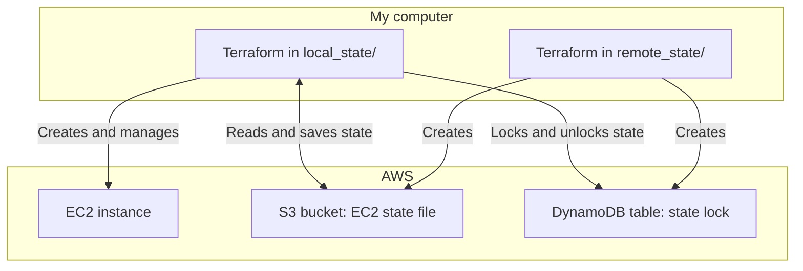
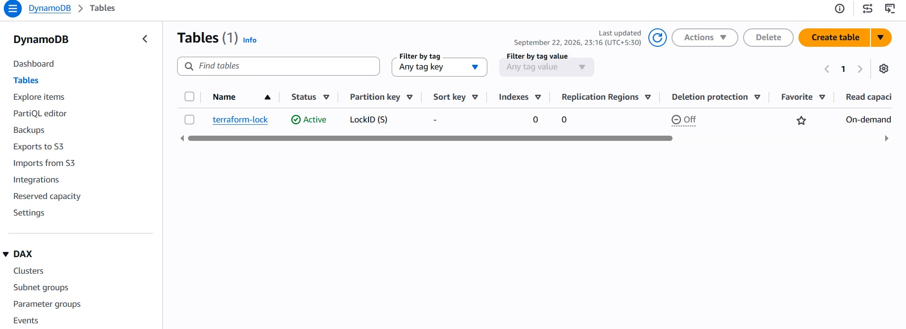

<div align="center">

# Terraform on AWS
### EC2 Provisioning · S3 Remote State · DynamoDB Locking


**A hands-on Infrastructure as Code project focused on provisioning EC2 and managing Terraform state with a shared backend.**

[Architecture](#architecture) · [Getting Started](#getting-started) · [State Migration](#migrating-existing-local-state) · [Screenshots](#project-screenshots) · 

</div>

## Project Overview

This project uses Terraform to create an AWS EC2 instance and configure an S3 remote backend with DynamoDB state locking. Terraform manages the instance, S3 stores the state, and DynamoDB coordinates access during operations that acquire a lock.

The implementation has two independent Terraform root configurations: one creates the backend resources; the other provisions EC2 and uses that backend.

## What This Project Demonstrates

| Capability | Implementation | Purpose |
| --- | --- | --- |
| Infrastructure as Code | `aws_instance.app_server` | Provision EC2 from version-controlled HCL |
| Remote state | Amazon S3 backend | Keep the EC2 state in a shared location |
| State history | S3 versioning | Retain earlier versions of the state object |
| Encryption at rest | S3 `AES256` configuration | Encrypt stored objects using S3-managed keys |
| State locking | DynamoDB with a string `LockID` key | Coordinate concurrent Terraform operations |
| Backend bootstrapping | Separate `remote_state/` configuration | Create the backend before initializing the EC2 configuration |
| Account-aware naming | `aws_caller_identity` and a local value | Derive the bucket name from the active account |

## Architecture



## Repository Structure

| Path | Purpose |
| --- | --- |
| `local_state/main.tf` | AWS provider settings and EC2 resource |
| `local_state/backend.tf` | S3 backend and DynamoDB locking settings |
| `local_state/.terraform.lock.hcl` | Provider dependency lock file for EC2 configuration |
| `remote_state/main.tf` | State bucket, versioning, encryption, and DynamoDB table |
| `remote_state/.terraform.lock.hcl` | Provider dependency lock file for backend configuration |
| `images/` | Screenshots of EC2, S3 state, DynamoDB, and lock testing |
| `.gitignore` | Excludes state files and local `.terraform` directories |

Run Terraform inside the appropriate configuration folder. Running it from the repository root does not recursively deploy these folders.

## Configuration at a Glance

| Setting | Repository value |
| --- | --- |
| Terraform requirement | `>= 1.5.0` |
| AWS provider constraint in `local_state/` | `~> 6.0` |
| EC2 region | `ap-south-1` — Mumbai |
| Instance type | `t3.micro` |
| Instance name tag | `Terraform_Demo` |
| Configured AMI | `ami-006f82a1d5a27da54` |
| Bucket naming pattern | `<AWS_ACCOUNT_ID>-terraform-states` |
| State object key | `development/service-name.tfstate` |
| DynamoDB table | `terraform-lock` |
| Table partition key | `LockID` — String |
| Table billing mode | `PAY_PER_REQUEST` |

The EC2 resource does not specify a subnet, security group, or SSH key pair. It relies on a default VPC/default subnet being available in the selected region. Confirm that the configured AMI is available and suitable for your account before applying.

## Getting Started

### 1. Prepare your environment

You need Git, Terraform matching the configuration requirements, AWS CLI, and an authenticated AWS identity with permissions to manage the resources and access the backend.

Configure credentials using your preferred AWS authentication method, then check the active identity and set the region:

```bash
aws sts get-caller-identity
export AWS_REGION=ap-south-1
export AWS_DEFAULT_REGION=ap-south-1
```

The region environment variables matter because `remote_state/main.tf` uses an empty `provider "aws" {}` block. Create the backend resources in the region referenced by `local_state/backend.tf`.

### 2. Clone the repository

```bash
git clone https://github.com/ramasubramanian06/Terraform-project.git
cd Terraform-project
```

### 3. Create the backend resources

```bash
cd remote_state
terraform init
terraform plan
terraform apply
```

Review the plan before approving. This creates the state bucket and DynamoDB table. Preserve the local state generated in this folder: it tracks the backend resources themselves.

### 4. Configure the EC2 backend

Open `local_state/backend.tf` and replace the committed bucket name with the bucket created in your AWS account:

```hcl
terraform {
  backend "s3" {
    bucket         = "<YOUR_AWS_ACCOUNT_ID>-terraform-states"
    key            = "development/service-name.tfstate"
    region         = "ap-south-1"
    encrypt        = true
    dynamodb_table = "terraform-lock"
  }
}
```

Replace the placeholder with the actual account ID. The backend cannot directly reference `local.account_id` from the separate bootstrap configuration.

### 5. Deploy the EC2 instance

For a fresh deployment with no existing local EC2 state:

```bash
cd ../local_state
terraform init
terraform plan
terraform apply
```

Terraform uses the remote backend to store EC2 state. If you already created the instance with local state, follow the migration section before running another apply.

## Migrating Existing Local State

Use this workflow in the **original working directory containing the existing EC2 state**, after creating the backend and updating `backend.tf`. A fresh clone does not contain ignored local state files.

1. Make a private backup of the existing `terraform.tfstate`.
2. Run `terraform init` .
3. Review and accept the state-copy prompt when Terraform presents it.
4. Check the resulting resource mapping and plan:

```bash
terraform state list
terraform plan
```

The state should include `aws_instance.app_server`. Investigate an unexpected create or replacement plan before proceeding. Backend migration moves Terraform's state; it does not require recreating EC2.

## Verification

After applying, check these items in AWS:

- **EC2:** An instance tagged `Name = Terraform_Demo` exists in Mumbai.
- **S3:** The configured bucket contains `development/service-name.tfstate` in the default Terraform workspace.
- **Versioning:** The bucket has versioning enabled; subsequent state writes can produce additional object versions.
- **Encryption:** The bucket has the configured default encryption settings.
- **DynamoDB:** The `terraform-lock` table exists with the `LockID` string partition key.

**Verify locking is working:**

Run `terraform apply` in two terminals at the same time from `local_state/`. The second run fails with a `ConditionalCheckFailedException` from DynamoDB — proof the lock is doing its job.

## Project Screenshots

### EC2 Instance


### State File in Amazon S3


### DynamoDB Table



### State Lock Test


## Cleanup

To remove EC2, run this from `local_state/` and review the proposed destruction:

```bash
terraform plan -destroy
terraform destroy
```

---

**Author:** [Ramasubramanian](https://github.com/ramasubramanian06)  
**Focus:** DevOps · AWS · Infrastructure as Code
